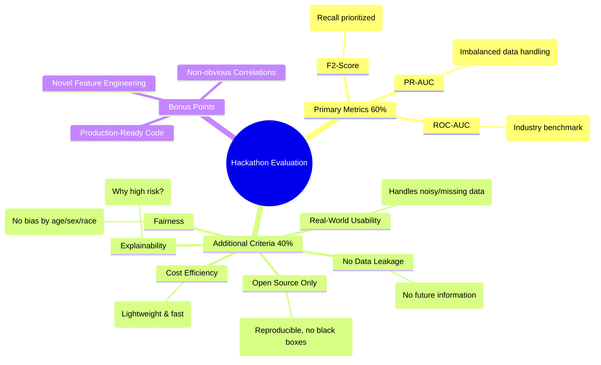

# HEA Hackathon 2025 - Hidden Health Signals

## Quick Start (3 commands to win)

1. **Install dependencies**:
   ```bash
   pip install -r requirements.txt
   ```

2. **Run Pipeline**:
   ```bash
   # Preprocess data
   python src/preprocess.py --config config.yaml
   
   # Train model (saves artifacts to models/)
   python src/train.py --config config.yaml
   
   # Evaluate (generates reports)
   python src/evaluate.py --config config.yaml
   ```

3. **Predict**:
   ```bash
   python src/predict.py --input data/raw/test.csv --output data/processed/predictions.csv
   ```

## Structure
- `data/`: managed by `config.yaml`. Do not commit raw data.
- `src/`: reproducible source code.
- `reports/`: `leakage_report.md`, `fairness_report.md`, `model_card.md`.
- `notebooks/`: `01_eda.ipynb` for initial exploration.

## Reports
- [Model Card](reports/model_card.md)
- [Leakage Audit](reports/leakage_report.md)

## Evaluation Criteria



### Detailed Evaluation Criteria

#### Primary Metrics (60% of score)
We will measure how well your model predicts who will get sick using three metrics:

*   **F2-Score**: Measures how well you catch people who will develop a disease. We prioritize recall over precision — missing a sick person is worse than a false alarm.
*   **PR-AUC (Precision-Recall Area Under Curve)**: Shows how your model performs with imbalanced data. Most people in the dataset are healthy, and your model must handle that well.
*   **ROC-AUC**: The industry standard metric that allows us to compare your solution with published benchmarks.

#### Additional Criteria (40% of score)
*   **No Data Leakage**: Your model must not use features that already reveal the disease. For example, if someone takes medication for diabetes, they already have diabetes — that's cheating. We will audit your feature set.
*   **Real-World Usability**: Your model will receive self-reported data from regular people, not clinical records. It must handle noisy, incomplete, and inconsistent inputs gracefully.
*   **Cost Efficiency**: Simple beats expensive. A lightweight model that runs fast is better than an overengineered solution with costly API calls.
*   **Open Source Only**: All tools, libraries, and data sources must be open and reproducible. No proprietary black boxes.
*   **Explainability**: Can you explain why your model flagged someone as high-risk? Both users and doctors need to understand the reasoning.
*   **Fairness**: Your model should not discriminate by age, gender, or ethnicity. We will check for bias.

#### Bonus Points
We will award extra points for novel feature engineering, discovery of non-obvious correlations, and production-ready code quality.
