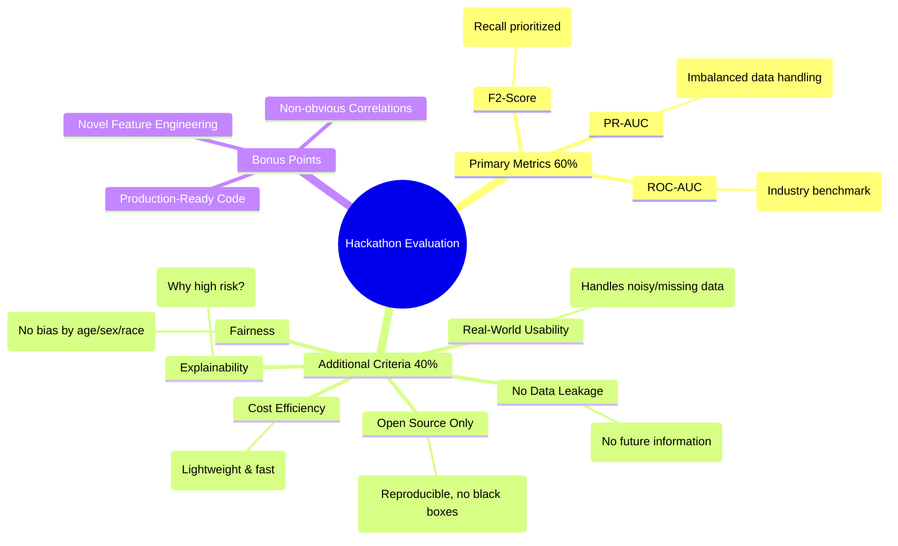

# HEA Hackathon 2025 - Hidden Health Signals

## Project Overview
This project aims to detect early health risks using longitudinal data from the Health and Retirement Study (HRS). It features a robust **FastAPI backend** for predictions and a set of **Jupyter Notebooks** for deep data analysis.

---

## 🚀 Quick Start: Data Analysis (Google Colab)

To reproduce the analysis or run the feature extraction notebooks, you must set up the data in Google Drive.

### 1. Data Setup
1.  Download the **HRS 2022 Fat File** (`h22e3a.csv`).
2.  Upload it to your Google Drive in the root folder or a specific `data/raw/` folder.
3.  Mount Drive in Colab when prompted by the notebooks.

### 2. Notebooks
*   `notebooks/02_h22_analysis.ipynb`: **Data Integrity & Health Signals**. Checks if the file contains valid health/cognition data.
*   `notebooks/03_advanced_correlations.ipynb`: **Cross-Domain Analysis**. Hunts for non-obvious correlations between lifestyle/demographics and chronic conditions.

---

## 🛠️ Local API Setup (Prediction Service)

The prediction API runs locally using Docker or Python directly. It predicts health risks based on a user's self-reported data.

### Option A: Docker (Recommended)
This ensures all dependencies (including heavy ML libraries) are installed correctly.

```bash
docker-compose up --build
```
*   **API URL**: `http://localhost:8001`
*   **Documentation**: `http://localhost:8001/docs`

### Option B: Local Python
Requires Python 3.11+.

```bash
python -m venv .venv
source .venv/bin/activate
pip install -r requirements.txt
uvicorn src.api:app --reload --host 0.0.0.0 --port 8001
```

### 🧪 Testing the API
You can send a prediction request using `curl`:

```bash
curl -X POST "http://localhost:8001/predict" \
     -H "Content-Type: application/json" \
     -d '{
           "age": "65",
           "sex": "Male",
           "bmi": "28.5",
           "systolic_bp": "145",
           "stress_level": 8,
           "smoking_status": "Former",
           "alcohol_frequency": "Weekly",
           "physical_activity_days_per_week": "1"
         }'
```

---

## 🏆 Evaluation Criteria



### Detailed Criteria

#### Primary Metrics (60% of score)
*   **F2-Score**: Prioritize recall. Missing a sick person is worse than a false alarm.
*   **PR-AUC**: Evaluation on imbalanced data.
*   **ROC-AUC**: Industry benchmark.

#### Additional Criteria (40% of score)
*   **No Data Leakage**: No use of features that reveal the target (e.g., medication use).
*   **Real-World Usability**: Handle missing/noisy self-reported inputs.
*   **Explainability**: The model must explain *why* a risk score is high (see `top_factors` in API response).